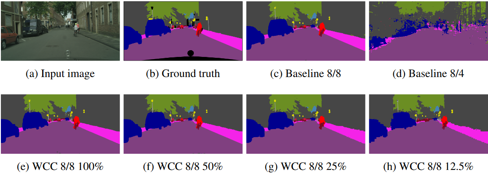

# WaveletCompressedConvolution
Official implementation for [Wavelet Feature Maps Compression for Image-to-Image CNNs](https://arxiv.org/abs/2205.12268), NeurIPS 2022.

<p align='center'>

</p>

# Use as a Drop-in Replacement

Code example is available at `WCC/transform_model.py`.  
Note that it is a common practice to avoid quantizing/compressing the first and last layers of the network.

# Recreating Paper Experiments

For best results it's recommended to reduce the number of bits and the compression rate gradually.  
E.g., load quantized 8/8 checkpoint to train quantized 8/6, load 4/8 checkpoint to train wcc 4/8 50%, and load wcc 25% to train wcc 12.5%.

In all the experiments we used a popular implementation, and changed only the main file to include the model transform after creation. For example, from the Deeplab implementation:
```
WCC.wavelet_deeplabmobilev2(model, opts.wt_levels, opts.wt_compression, opts.bit_w, opts.bit_a)
```

## 1. Object Detection
We used the following implementation:  
https://github.com/rwightman/efficientdet-pytorch

|  Precision | Wavelet Shrinkage  | BOPs(B) | mAP &uarr; |
| :--------: | :----------------: | :-----: | :--------: | 
| FP32       | ---                |  6,144  |   40.08    |
| 4/8        | ---                |  280.4  |   31.44    |
| 4/8        | 50%                |  198.5  |   31.15    |
| 4/8        | 25%                |  155.4  |   27.49    |


## 2. Semantic Segmentation
We used the following implementation:  
https://github.com/VainF/DeepLabV3Plus-Pytorch

We trained the model with the optional flag `--separable_conv`.

Cityscapes results: (see paper for Pascal VOC as well as more configurations)
|  Precision | Wavelet Shrinkage  | BOPs(B) | mIoU &uarr; |
| :--------: | :----------------: | :-----: | :---------: | 
| FP32       | ---                |  36,377 |   0.717     |
| 8/8        | ---                |  2,273  |   0.701     |
| 8/6        | ---                |  1,705  |   0.683     |
| 8/4        | ---                |  1,136  |   0.173     |
| 8/8        | 50%                |  1,213  |   0.681     |
| 8/8        | 25%                |  673    |   0.620     |
| 8/8        | 12.5%              |  403    |   0.552     |

## 3. Depth Prediction
We used the following implementation:  
https://github.com/nianticlabs/monodepth2

|  Precision | Wavelet Shrinkage  | BOPs(B)  | AbsRel &darr; | RMSE &darr; |
| :--------: | :----------------: | :-----:  | :-----------: | :---------: | 
| FP32       | ---                |  1,163.6 |   0.093       |   4.022     |
| 8/8        | ---                |  133.6   |   0.092       |   4.018     |
| 8/4        | ---                |  99.26   |   0.097       |   4.166     |
| 8/2        | ---                |  82.1    |   0.268       |   8.223     |
| 8/8        | 50%                |  103.9   |   0.098       |   4.217     |
| 8/8        | 25%                |  88.5    |   0.112       |   4.663     |
| 8/8        | 12.5%              |  80.8    |   0.131       |   5.046     |

## 4. Super-resolution
We used the following implementation:  
https://github.com/sanghyun-son/EDSR-PyTorch


# Citation

```
@inproceedings{finder2022wavelet,
  title={Wavelet Feature Maps Compression for Image-to-Image CNNs},
  author={Finder, Shahaf E and Zohav, Yair and Ashkenazi, Maor and Treister, Eran},
  booktitle={Advances in Neural Information Processing Systems},
  year={2022}
}
```
